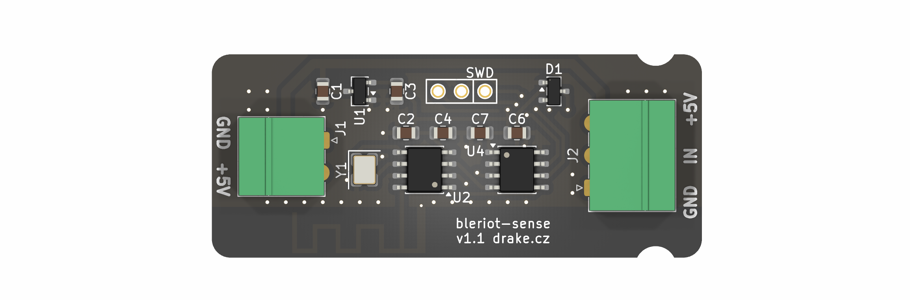
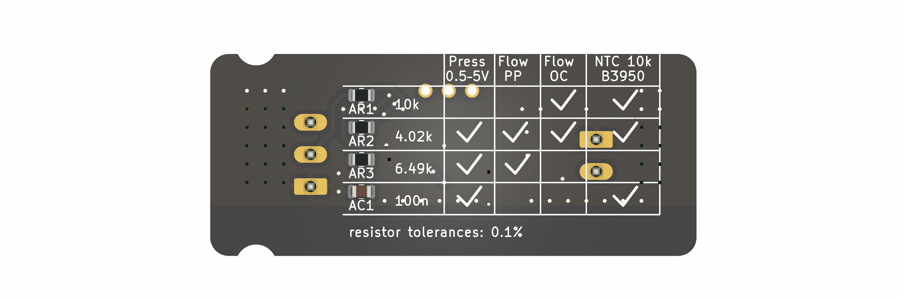

# BleRiot Sense

BleRiot Sense is a compact single-sensor BleRiot node built around a
`PY32F003L16S6TU` microcontroller and a PAN2110 long-range 2.4 GHz radio. Its
sensor input is configured at assembly time for one of three uses:

- A 10 kΩ B3950 NTC thermistor.
- A pulse-output flow sensor such as the YF-B10.
- A pressure sensor with a driven 0.5-5 V analog output.

The assembly population and the firmware mode must agree. The hardware does not
switch sensor modes electronically at runtime.




## Repository layout

| Path | Description |
|---|---|
| [`board/bleriot-sense.kicad_pro`](board/bleriot-sense.kicad_pro) | `PY32F003L16S6TU` hardware |
| [`fw/`](fw/README.md) | BleRiot node firmware and hub inventory |
| [`ANALOG-INPUT.md`](ANALOG-INPUT.md) | Analog input circuit, populations, calculations, protection, and layout |
| [`sub/hw-kicad/`](sub/hw-kicad) | Shared KiCad symbols and footprints, included as a Git submodule |

## Sensor modes

| Mode | Node measurement | Registry value |
|---|---|---|
| NTC | Averaged 12-bit ADC code | Temperature in °C |
| Flow | Rising-edge pulse count | Frequency in Hz and cumulative pulse count |
| Pressure | Averaged 12-bit ADC code | Reconstructed sensor-output voltage in V |

See [`ANALOG-INPUT.md`](ANALOG-INPUT.md) before assembling a board. It defines
the required values for `AR1`, `AR2`, `AR3`, and `AC1`, including the two
alternative flow-sensor output circuits.

The pressure transfer function and flow K-factor depend on the exact sensor.
The hub currently exposes pressure input voltage and flow frequency without
assuming undocumented sensor calibration constants.

## Firmware status

[`fw`](fw/README.md) targets the `PY32F003L16S6TU` and uses `PA0` for
the universal sensor input. The NTC path has been verified end to end on
hardware through the ADC, PAN2110 radio, MCP2210 hub dongle, BleRiot hub,
conversion layer, and Registry. Flow and pressure support build and have
host-side conversion coverage but still require mode-specific hardware tests.

The upstream TinyGo `py32f003x6` target provides the required 1 KiB system
stack. The firmware runs without a task scheduler. See the firmware README for
pin assignments, first-boot option-byte handling, configuration, and memory
constraints.

## Getting started

Initialize the shared KiCad library after cloning:

```sh
git submodule update --init --recursive
```

Open the hardware project in KiCad:

```sh
kicad board/bleriot-sense.kicad_pro
```

Configure `sensorMode` in
[`fw/test-hub.go`](fw/test-hub.go), then test and build the firmware:

```sh
go -C fw test ./...
go -C fw run . make sense build
```

Flash with a supported SWD probe:

```sh
go -C fw run . make sense flash
```

With a Registry server running, start the hub in a separate terminal:

```sh
go -C fw run . hub --registry http://localhost:8080 --diagnostics rf
```

For an NTC-configured node, read live temperatures:

```bash
export REGISTRY=http://localhost:8080
reg get sense.temperature --stay
```

## Toolchain

- KiCad 10 for the hardware projects.
- Go 1.25.2 or newer for the firmware inventory, generator, tests, and hub.
- TinyGo with the Puya `py32f003x6` target.
- pyOCD with the Puya CMSIS pack and a supported SWD probe.
- An MCP2210/PAN2110 BleRiot hub dongle for RF operation.
- The [`reg`](https://github.com/burgrp/reg) Registry service and CLI.
