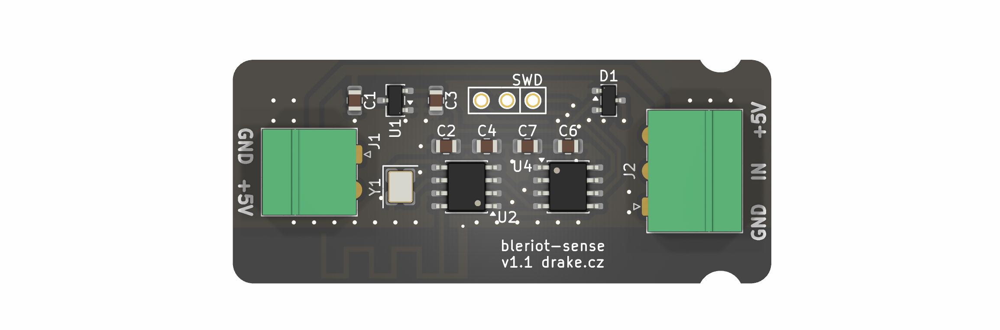
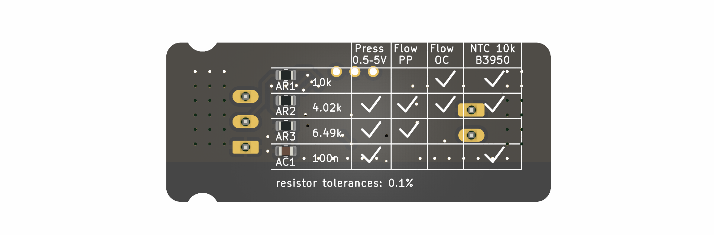

# BleRiot Sense

BleRiot Sense is a compact single-sensor BleRiot node built around a
`PY32F003L16S6TU` microcontroller and a PAN2110 long-range 2.4 GHz radio. Its
sensor input is configured at assembly time for one of four uses:

- A 10 kΩ B3950 NTC thermistor.
- A pulse-output flow sensor such as the YF-B10.
- A pressure sensor with a driven 0.5-5 V analog output.
- An externally powered DS18B20 digital thermometer.

The assembly population and the firmware mode must agree. The hardware does not
switch sensor modes electronically at runtime.




## Repository layout

| Path | Description |
|---|---|
| [`board/bleriot-sense.kicad_pro`](board/bleriot-sense.kicad_pro) | `PY32F003L16S6TU` hardware |
| [`fw/`](fw/README.md) | Importable Sense firmware and board-owned build profile |
| [`fw/cmd/dev/`](fw/cmd/dev/) | Local inventory and BleRiot CLI |
| [`ANALOG-INPUT.md`](ANALOG-INPUT.md) | Configurable input circuit, populations, calculations, protection, and layout |
| [`sub/hw-kicad/`](sub/hw-kicad) | Shared KiCad symbols and footprints, included as a Git submodule |

## Sensor modes

| Mode | Node measurement | Registry value |
|---|---|---|
| NTC | Averaged 12-bit ADC code | Temperature in °C |
| Flow | Rising-edge pulse count | Frequency in Hz and cumulative pulse count |
| Pressure | Averaged 12-bit ADC code | Reconstructed sensor-output voltage in V |
| DS18B20 | Up to 20 signed Q12.4 scratchpad values | Temperature registers in °C |

See [`ANALOG-INPUT.md`](ANALOG-INPUT.md) before assembling a board. It defines
the required values for `AR1`, `AR2`, `AR3`, and `AC1`, including the two
alternative flow-sensor output circuits.

The pressure transfer function and flow K-factor depend on the exact sensor.
The hub currently exposes pressure input voltage and flow frequency without
assuming undocumented sensor calibration constants.

## Firmware status

[`fw`](fw/README.md) targets the `PY32F003L16S6TU` and uses `PA0` for
the universal sensor input. The NTC path has been verified end to end on
hardware through the ADC, PAN2110 radio, MCP2210 hub dongle, BleRiot hub,
conversion layer, and Registry. The single-sensor DS18B20 path has also been
verified end to end through its 1-Wire bus and the same radio/Registry path;
multidrop behavior still requires hardware validation. Flow and pressure support build and have
host-side conversion coverage but still require mode-specific hardware tests.

DS18B20 firmware prints discovered ROM IDs over RTT at boot. A single sensor
needs no configured ID; multidrop inventories map each temperature register to
an explicit ID. See the firmware README for configuration and timing details.

The upstream TinyGo `py32f003x6` target provides the required 1 KiB system
stack. The firmware runs without a task scheduler. See the firmware README for
pin assignments, first-boot option-byte handling, configuration, and memory
constraints.

## Getting started

Initialize the shared KiCad library after cloning:

```sh
git submodule update --init --recursive
```

Open the hardware project in KiCad:

```sh
kicad board/bleriot-sense.kicad_pro
```

Configure `sensorMode` in
[`fw/cmd/dev/main.go`](fw/cmd/dev/main.go), then test and build the firmware:

```sh
go -C fw test ./...
go -C fw run ./cmd/dev node build --name sense
```

Flash with a supported SWD probe:

```sh
go -C fw run ./cmd/dev node build --name sense --flash --rtt
```

With a Registry server running, start the hub in a separate terminal:

```sh
go -C fw run ./cmd/dev hub --registry http://localhost:8080 --diagnostics rf
```

For an NTC-configured node, read live temperatures:

```bash
export REGISTRY=http://localhost:8080
reg get sense.temperature --stay
```

## Toolchain

- KiCad 10 for the hardware projects.
- Go 1.25.2 or newer for the firmware inventory, generator, tests, and hub.
- TinyGo with the Puya `py32f003x6` target.
- pyOCD with the Puya CMSIS pack and a supported SWD probe.
- An MCP2210/PAN2110 BleRiot hub dongle for RF operation.
- The [`reg`](https://github.com/burgrp/reg) Registry service and CLI.
